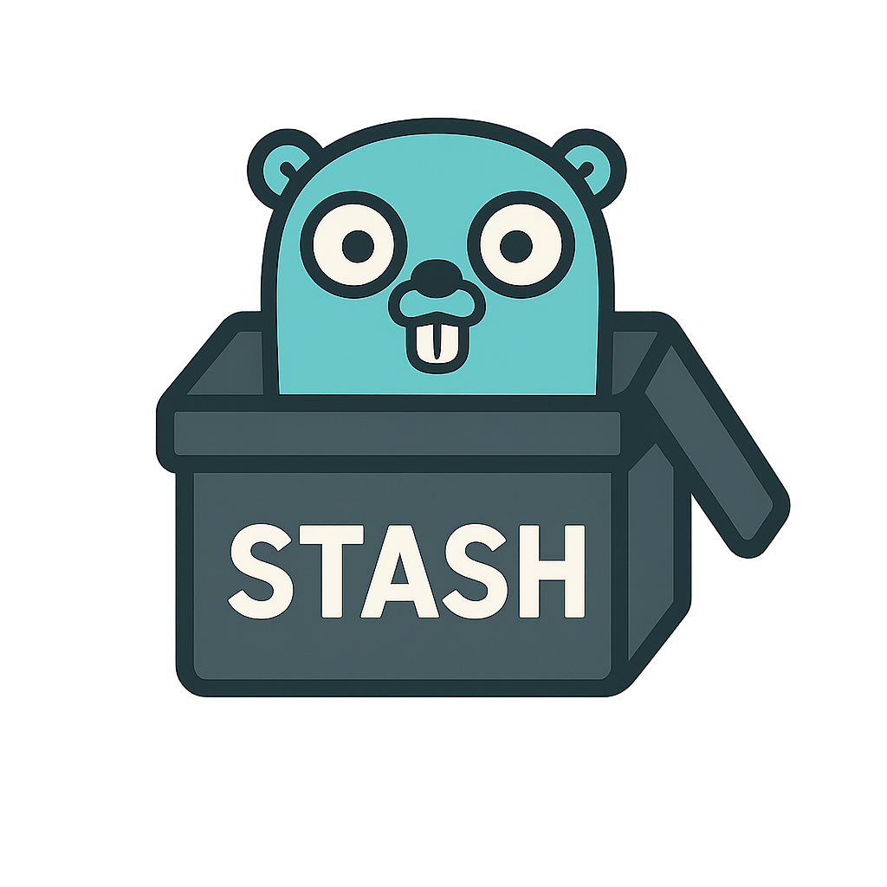

# GoStash



GoStash is a lightweight in-memory key-value cache inspired by Redis and Memcached. It aims to provide a simple, fast, and easy-to-run caching server for development and small production use-cases. The project is written in Go and follows a minimal design that focuses on low-latency operations and simple configuration.

## Features

- In-memory key-value storage
- Simple and minimal configuration system
- CLI for running the server and loading configuration
- Small codebase intended for learning, experimentation and lightweight caching

> Note: GoStash is an independent project and not a drop-in replacement for Redis or Memcached. Protocol and feature set are intentionally minimal.

## Repo layout

- `cmd/server/` - server binary entrypoint
- `internal/config/` - configuration loading and CLI helpers
- `internal/server/` - server implementation

## Quick start

Requirements:

- Go 1.25+ installed

Build and run the server locally:

PowerShell (Windows):

```powershell
go build -o gostash ./cmd/server
# run the server with default settings
./gostash.exe
```

Or using `go run`:

```powershell
go run ./cmd/server
```

The server will start and listen on the configured address (see Configuration below).

## Configuration

Configuration is handled by the `internal/config` package. The project supports loading configuration from files and command-line flags. Typical settings include server listen address, storage limits, and logging options.

Example configuration:

```text
host=localhost
port=8080
```

To pass a configuration file or flags, use the CLI options exposed by the `cmd/server` binary. For example:

```powershell
.\gostash.exe --config path\to\.config.stash
```
